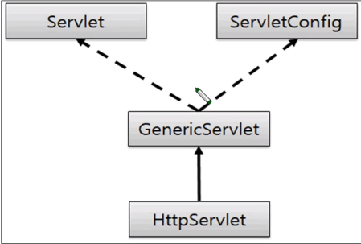

# study_JSP
JSP를 공부한 것을 정리하는 Repository

## JSP(Java Server Pages)
- HTML 코드에 JAVA 코드를 넣어 동적 웹페이지를 생성하는 웹 애플리케이션 도구이다.
- JSP 실행 시 JAVA Servlet으로 변환되며 웹 애플리케이션 섭에서 동작되면서 필요한 기능을 수행하고 그렇게 생성된 데이터를 웹페이지와 함께 클라이언트로 응답한다.
  - JAVA Servlet: 웹 페이지를 동적으로 생성하기 위해 서버 측 프로그램이다.
- JSP 는 대표적인 동적 웹 프로젝트이다.
- JSP의 스파게티 코드 문제때문에 JSP MVC를 사용하게 된다.(그리고 JSP MVC의 문제점을 해결하기 위해 Spring MVC 를 사용한다.)

## 서블릿
- JSP 표준이 나오기 전에 만들어진 표준으로 자바로 웹 어플리케이션을 개발할 수 있도록 하기 위해 만들어졌다.
- 자바 클래스를 이용해서 웹 애플리케이션을 개발할 수 있다.
- 반드시 매핑을 해야하다
- 동전 웹 애플리케이션 컴포넌트로 java thread를 이용하여 동작한다.
- 클라이언트의 요청에 동적으로 작동하고, 응답은 html을 이용한다.
- MVC 패턴에서 Controller로 이용된다.


- GenericSevlet 추상 클래스는 Servlet과 ServletConfig 인터페이스를 구현한다.
- HttpServlet은 GenericServlet 추상클래스를 상속받는다.

### 서블릿 프로젝트 만들기
1. Dynamic Project 선택
2. Project 이름 작성 후 tomcat 연결하기
3. Web module의 파일 이름을 'WebContent'로 설정하기
4. 'Generate web.xml deployment description' 선택하기

#### web.xml에서 서블릿 매핑하기
`<servlet-name>`: 임의의 이름을 만들어 준다.
`<servlet-class>`: 매핑할 클래스 파일명을 패키지 명을 폼함하여 정확하게 입력한다.
`<url-pattern>`: servlet-class의 클래스를 매핑할 임의의 이름을 입력한다. 주의할 점은 /로 시작해야 한다.

## JSP와 서블릿의 차이점
- JSP(Java Server Page)은 확장자가 .jsp인 파일로 html 문서 안에 자바 언어를 삽입해 사용할 수 있도록 준다.
- 서블릿은 확장자가 .java인 파일로 자바의 일반적인 클래스와 동일한 개념으로 웹을 다룰 수 있도록 해주는 "HttpServlet" 클래스를 상속받은 클래스를 의미한다.
- 서블릿의 HTML 코드 출력 문제를 해결하기 위해 JSP 사용한다.

## JSP와 Spring의 차이점
- JSP는 웹 페이지 영역에서 사용되고, Spring은 웹 서비스 전반적 환경을 구성한다.

## 개발
- Eclipse 연결 후 Dynamic Web 만들기를 클릭해서 프로젝트를 만들면 폴더와 파일들이 생긴다. 이 중에서도 WebContent 폴더안에 만드는 것들이 Webpage를 구성하게 된다.


### 코드 설명
```
location.href = '[URL]';
```
- 바로 [URL]로 이동해라

#### 이외
- UTF-8 : 한글, 영어 모두 지원해주는 인코딩 언어

### Installation
- tomcat 다운
- Eclipse 다운
- Eclipse Dynamic web 만들기 클릭
- 거기에 다운 받았던 tomcat 연결
- [webapp] 폴더에 index.jsp 만들기 실행버튼 누르기 -> 'http://localhost:8080/'에 서버가 띄워짐.