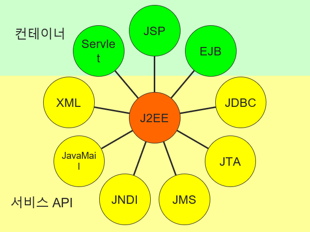

# study_JSP (인턴)

## 자바 Web 기술
- J2SE(Java 2 Standard Edition)
- J2EE(Java 2 Enterprise Edition) 
    - 서블릿과 JSP는 이것을 구성하는 기술 중 하나.
- J2ME(Java 2 Micro Edition)

### J2EE
- 클라이언트/서버 환경이나 웹 환경의 서버 단에서 수행되는 프로그램을 자바로 구현할 때 사용하는 자바 기술
</img>

    - 웹 컨테이너는 서블릿과 JSP 지원
    - 서블릿: Server Applet의 약어로서 자바 기반으로 이루어진 웹 프로그래밍 언어로 서버 쪽에서 실행하는 프로그램
    - JSP: Java Server Pages의 약어로 웹 페이지를 동적으로 처리되도록 하는 기술 중 하나. 서블릿 프로그래밍 기능을 HTML 파일 내에 태그와 스크립트 형식으로 구현하는 기술

### 서블릿
- 모든 서블릿의 접근 지정자는 public
- javax.servlet.http 패키지에서 제공하는 서블릿 클래스를 상속받아 구현
    - 대부분 서블릿 프로그램에서는 서블릿 인터페이스를 구현한 GenericServlet 클래스나 HttpServlet 클래스를 상속받아 구현.
- 수행은 서블릿 컨테이너에 의해서 처리되는데 서블릿이 요청될 때마다 스레드가 계속 생성되어 객체를 생성해서 수행.
- main 메소드를 가지지 않고 클라이언트가 어떤 방식으로 요청했느냐에 다라 그에 합당한 메소드가 호출되어 진행.
    - 클라이언트 요청방식: Get, Post
    - Get -> doGet: 폼을 출력하는 형태로 많이 쓰임.
    ```
    <form method="get" action="servlet/Method">
    <input type="submit" value="get 방식으로 호출하기" >
    </form>
    ```
        - URL 경로 뒤, 물음표와 함께 파라미터를 붙여 전송하고 각각의 파라미터를 &로 구분.
    - Post -> doPost: 데이터를 가공이나 처리코드로 사용.
    ```
    <form method="post" action="servlet/Method">
    <input type="submit" value="post 방식으로 호출하기" >
    </form>
    ```
        - header를 이용해 정보가 전송되어 보안에 강함.
### 서블릿 프로그램 설명
- HttpServletRequest: 객체에 의해서 요청이 처리.
- HttpServletResponse: 객체에 의해서 처리 결과가 응답.
- resp.setContentType: HttpServletResponse 클래스로 선언된 객체가 resp라면 setContentType 메소드를 호출하여 응답 방식을 결정하고 보여주고자 하는 코드셋을 지정해야 함.
- PrintWriter: 출력 스트림인 PrintWriter 객체를 HttpServletResponse 클래스로부터 가져옴.
- resp.setContentType("text/html;charset=euc-kr") : 페이지에 대해 한글을 출력할 경우 한글이 깨지지 않도록 하기 위해서 euc-kr로 코드셋을 지정해야 한다.
</br>

### JSP
- JSP가 서블릿으로 변환하는 요청은 단 한번뿐이기 때문에 처리 속도가 드리지 않는다.

### JSP 구조
- /bin: 실행 파일 이 존재
- /conf: 톰캣의 환경을 설정하기 위해 파일 존재
- /logs: 로그가 남는다
- /webapps: JSP 파일이나 웹 응용 프로그램 저장
- /lib 톰캣에 관련된 라이브러리 설치

### JSP 기본 태그의 종류
- 지시자 `<%@ 지시자  속성="값" . . .  %> `: JSP 페이지의 속성을 지정하며 JSP 문서의 제일 윗 부분에 위치
    - page: 해당 JSP 페이지에 전체 속성을 지정하여 JSP 컨테이너와 통신
        - language `<%@ page language="java" %>`:  스크립트릿에 사용되는 스크립트 언어를 기술
        - extends `<%@ page extends ="패키지명.클래스명" %> `: 상속받을 때 사용되며 패키지 이름가지 기술하여 클래스명을 기술해야 함.
        - import `<%@ page import ="package.class, package.*" %>`: 스크립트 모듈에서 사용될 자바 클래스나 자바 빈 클래스들을 해당 페이지에 불러드일 때 사용.
        - session `<%@ page session="false" %> `: 페이지가 세션에 참여할 것인가 여부를 기술(true 이면 session 변수가 현재 페이지에 대한 참조를 가짐.)
        - ` <%@ page errorPage="error.jsp" %> ` : JSP 페이지에 에러가 발생하였을 때 보여줄 에러 페이지를 설정.
        -  ` <%@ page isErrorPage="true" %> ` : true 설정이 되어 있으면 현재 페이지가 에러 페이지가 된다.
    - include: 현재 페이지에 다른 파일의 내용을 삽입할 때 상ㅇ
    - taglib: 태그 라이브러리 에게 태그를 꺼내와 사용할 수 있는 기능 제공
- 주석 `<%-- --%>`: JSP 페이지에 설명을 넣음.
- 선언 `<%! %>`: 변수와 메소드를 선언함.
- 표현식 `<%= %>`: 계산식이나 함수를 호출한 결과를 문자열 형태로 출력함. 이때 세미콜론을 기술하지 말아야 한다.
- 스크립트릿 `<% %>`: 자바 코드를 기술함.
- 액선 태그 ` <jsp: . . . 속성=“값” > 내용 </jsp: . . .> `: 자바 bean이나 애플릿 서버 모듈과 연결.

### JSP 동작 원리
1. 웹 브라우저에서 JSP 페이지를 웹 서버에게 요청
2. 웹 서버는 JSP에 대한 요청을 JSP 컨테이너에게 넘겨 JSP 컨테이너는 해당 JSP 페이지를 찾아 서블릿 파일 생성
3. 서블릿 파일은 컴파일 되어 서블릿 클래스 파일을 생성
4. 컴파일된 서블릿 클래스 파일이 클라이언트의 웹 브라우저로 응답
5. 사용자는 응답 결과를 확인

### request, response 객체의 개념
- request: 클라이언트에서 서버로 전송되는 데이터를 알 수 있음.
- response: 서버에서 클라이언트에 대한 응답을 response 객체를 통해 처리.

### 쿠키
- 사용자측에 대한 정보를 보관해두었다가 웹 서버의 요청에 의해 그 정보를 원하느 순간 사용 가능.
- 쿠키의 크기는 4KB 이하로 제한되어 있고 300개까지의 데이터 정보 배열을 저장가능. 크기가 제한되어 있기 때문에 오래된 정보는 자동으로 삭제 됨.
- HTTP 비 연결지향형 서비스의 단점을 극복하기 위해 쿠키를 사용
- 사용자의 정보를 지속적으로 유지하기 위해 사용.
- 서버가 아닌 클라이언트 컴퓨터의 하드디스크에 사용자의 정보를 저장하기 때문에 서버의 동작에 무리를 주지 않으면서 사용자의 정보를 적절하게 사용 가능.
- 웹 서버가 웹 브라우저에게 응답할 때 HTTP 프로토콜에 있는 HTTP 헤더에 쿠키의 정보를 포함하여 클라이언트 쪽으로 전달.
- 쿠키를 이용하기 위해 request와 response를 사용하는데 쿠키의 값을 가져올 때는 'request'를 쿠키를 설정하고자 할 때는 'response' 객체를 사용해서 쿠키의 값을 설정.

### 쿠키 설정하기
1. 쿠키 객체를 생성 : `Cookie info = new Cookie([쿠키의 이름],[쿠키의 값]); `
2. 쿠키 객체에 속성값 설정
    - `void setMaxAge(int expiry); `: 쿠키를 사용할 수 있는 유효기간을 결정하는 메소드
    - `void setPath(java.lang.String uri)` : 쿠키의 유호 디렉토리를 설정하려면 setPath 메소드를 사용
3. 쿠키 추가하기: `response.addCookie(info); `

### 쿠키에 저장된 정보를 서버로 읽어오기
1. 쿠키 객체 얻어오기 - ` Cookie[] cookies = request.getCookies(); `
2. 쿠키 객체에 설정된 속성값을 알아낸다.

### 자바 빈
- 재사용 가능한 객체로서 대부분 데이터를 저장하는 역할을 한다.
- 클래스로 구성되어 구성요소 또한 필드와 메소드가 된다.
- 데이터를 표현하는 것을 목적으로 하는 자바 클래스이다.
- 자바 빈 프로퍼터
    - 저장되어 있는 값을 의미한다.
    - 자바 빈은 프로퍼티 형태로 값을 저장하고 읽어온다.
    - 프로퍼티를 위한 메소드는 setXXX와 getXXX 형태로 정의해야 한다.

### JDBC를 이용한 데이터베이스 조작
1. JDBC 드라이버 로드
```
 import java.sql.*;
 Class.forName("oracle.jdbc.driver.OracleDriver"); 
```
2. DB와 연결
```
Connection con = null;
con=DriverManager.getConnection([url], [uid], [pwd]);  
```
3. SQL 문 실행
4. DB와 연결을 끊는다.

### DBCP 기법
- 접속인원이 많은 웹 페이지에서 데이터베이스의 효율성과 속도를 높이기 위해서 사용한다. 
- DBCP 매니저가 어느 정도의 연결을 확보해 놓고 있다가 클라이언트의 요청이 들어오면 연결해 주고, 클라이언트 작업이 다 끝나면 연결을 다시 풀 매니저한테 반환하게 만드는 것이다.
- DataSource를 통한 DBCP 사용하기
    1. InitialContext 객체 생성
    ```
    InitialContext ctx=new InitialContext();
    ```
    2. 컨텍스트 객체의 lookup 메서드로 DBCP에서 지정한 이름을 찾는다. 존재한다면 DataSource가 받는다.
    ```
    DataSource ds=(DataSource)ctx.lookup("java:comp/env/jdbc/oracle");
    ```
    3. DataSource 객체로 Connection 얻기
    ```
     con=ds.getConnection();                                          
    ```
